# Zellner Theme

[](https://marketplace.visualstudio.com/items?itemName=YueYu.vscode-theme-zellner)
[](https://open-vsx.org/extension/YueYu/vscode-theme-zellner)
[](LICENSE)

Port of Ron Aaron's classic [**`zellner`**](references/zellner.vim) Vim light color scheme to Visual Studio Code and modern development tools, built on a deterministic semantic theme abstraction layer modeled after VS Code's **2026 Light** and **2026 Dark** architectures (see [2026 Dark Architecture Findings](docs/2026-dark-findings.md)).

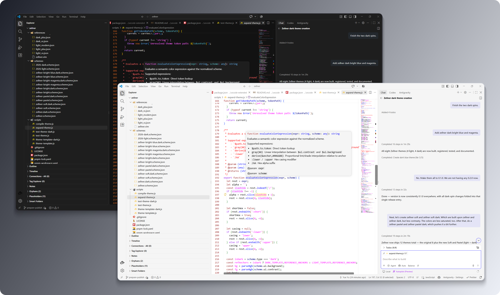

---

## 📦 Extension Packages

This monorepo publishes two companion extensions across the **Visual Studio Code Marketplace** and **Open VSX Registry** (for Cursor, Windsurf, VSCodium, Antigravity, Positron, etc.):

| Package | Themes Included | Install Links |
| :--- | :--- | :--- |
| **[Zellner Theme](packages/vscode/README.md)** (`YueYu.vscode-theme-zellner`) | **2 Core Themes**: `Zellner` (Light) & `Zellner Dark` | [VS Code Marketplace](https://marketplace.visualstudio.com/items?itemName=YueYu.vscode-theme-zellner) · [Open VSX](https://open-vsx.org/extension/YueYu/vscode-theme-zellner) |
| **[Zellner Theme Extended](packages/vscode-extended/README.md)** (`YueYu.vscode-theme-zellner-extended`) | **8 Extended Variants**: `Bright`, `Bright Magenta`, `Soft`, and `Pastel` (Light & Dark) | [VS Code Marketplace](https://marketplace.visualstudio.com/items?itemName=YueYu.vscode-theme-zellner-extended) · [Open VSX](https://open-vsx.org/extension/YueYu/vscode-theme-zellner-extended) |

---

## 🖼️ Theme Gallery

### Core Pack (`vscode-theme-zellner`)

| **Zellner** (Light) | **Zellner Dark** |
| :---: | :---: |
| 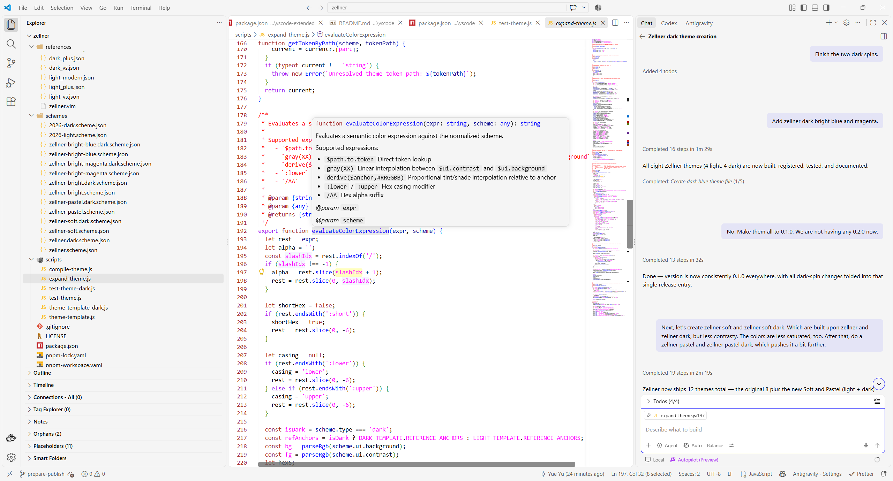 | 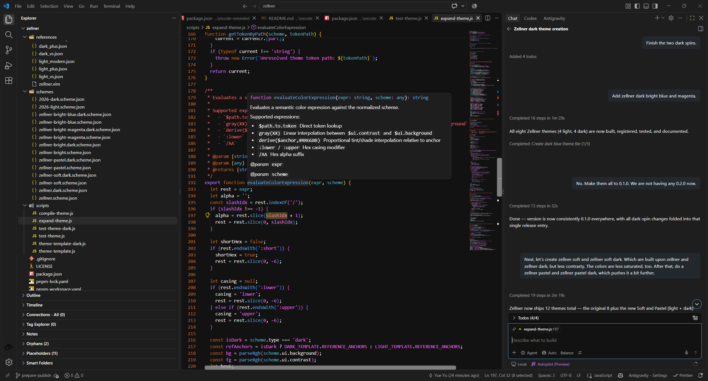 |

### Extended Pack (`vscode-theme-zellner-extended`)

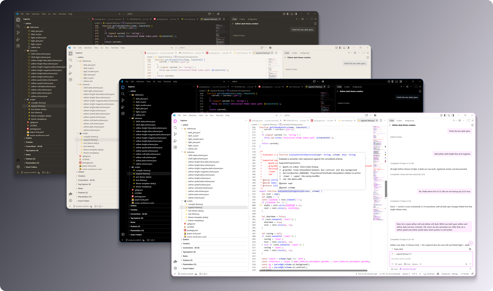

| Variant Family | Light | Dark |
| :--- | :---: | :---: |
| **Zellner Bright**<br>High-contrast pure white / pitch black surfaces with magenta tab accents | 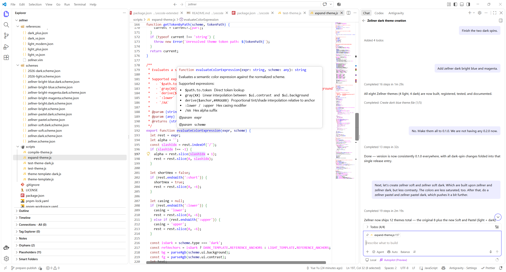 | 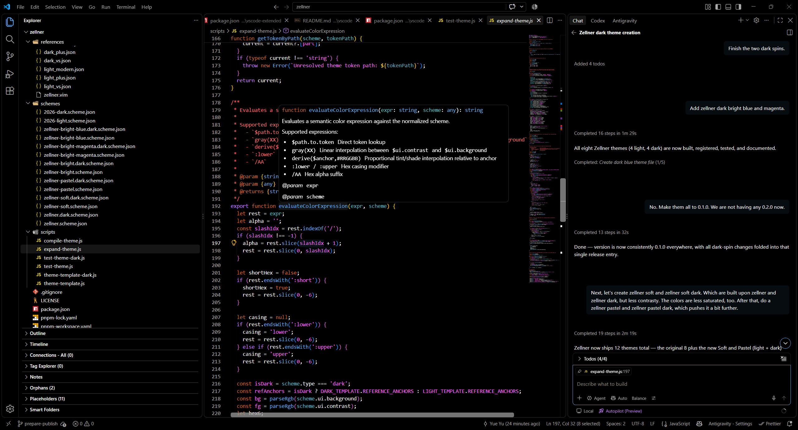 |
| **Zellner Bright Magenta**<br>High-contrast surfaces with vibrant magenta interactive accents | 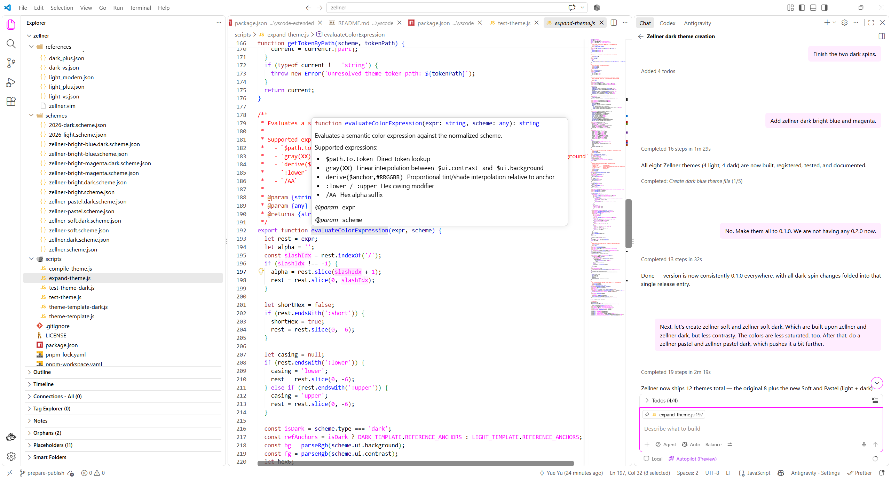 | 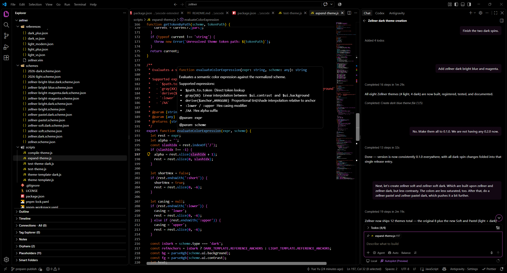 |
| **Zellner Soft**<br>Warm, reduced-glare canvas (`#FAF9F6` / `#181A1F`) with desaturated hues | 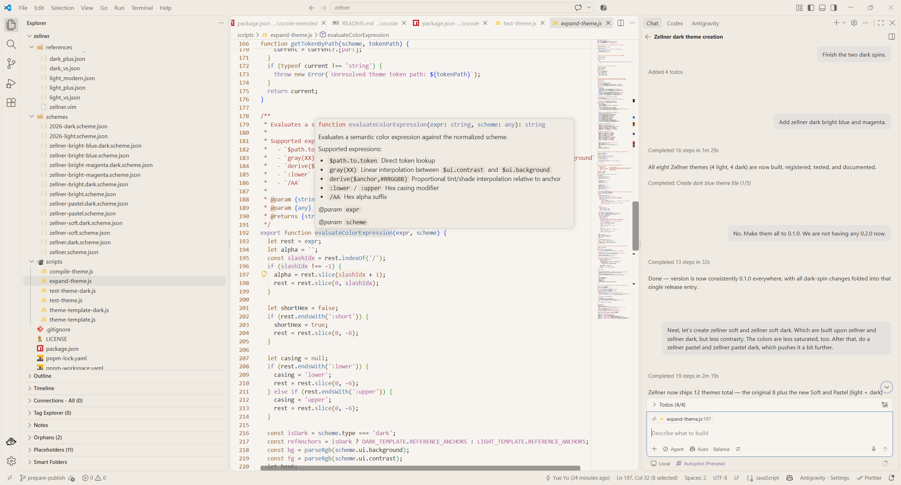 | 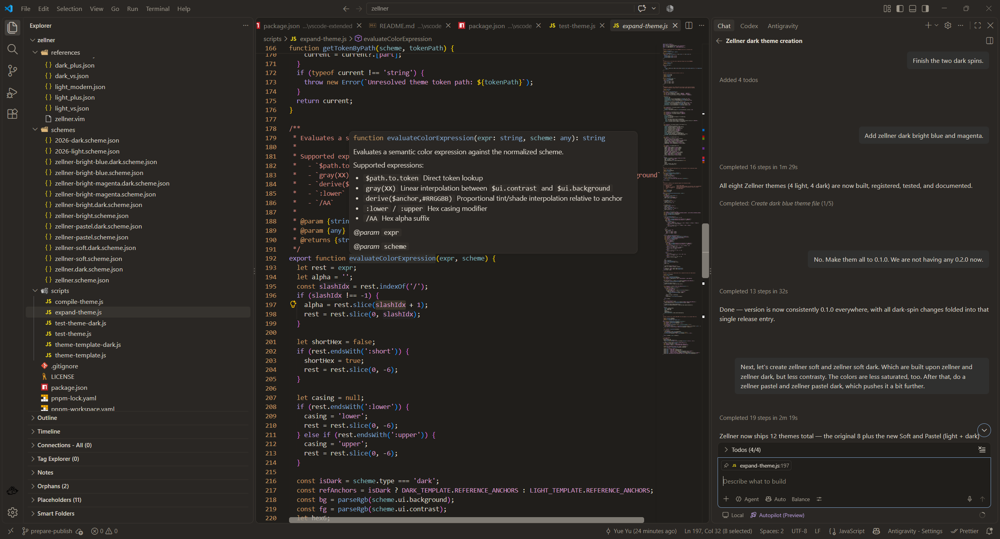 |
| **Zellner Pastel**<br>Gentle, low-saturation pastel palette for long coding sessions | 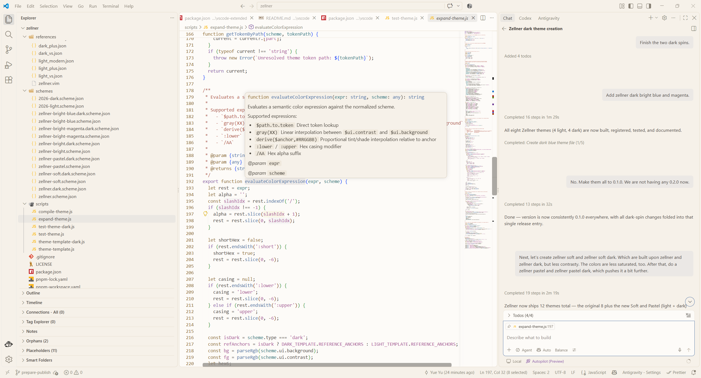 | 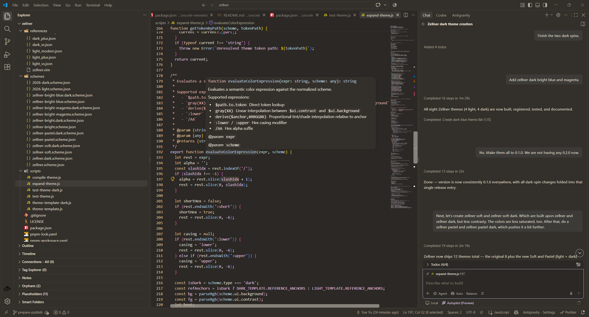 |

---

## Project Structure

```text
zellner/
├── assets/                          # Hero banners and theme screenshots
│   ├── hero-core.png                # Stacked hero preview for Zellner Core
│   ├── hero-extended.png            # Stacked hero preview for Zellner Extended
│   └── screenshots/                 # Full-resolution captures of all 10 themes
├── docs/
│   └── 2026-dark-findings.md        # Technical analysis of 2026 Light vs. 2026 Dark
├── interim/                         # Compiled and expanded theme snapshots
│   ├── 2026-light.compiled.json     # Flattened reference theme (include chain resolved)
│   ├── 2026-light.expanded.json     # Generated reference output from minimal scheme
│   ├── 2026-dark.compiled.json      # Flattened dark reference theme (include chain resolved)
│   └── 2026-dark.expanded.json      # Generated dark reference output from minimal scheme
├── packages/                        # Monorepo target packages
│   ├── vscode/                      # Core VS Code pack (2 themes)
│   └── vscode-extended/             # Extended VS Code pack (8 themes)
├── references/                      # Upstream reference color schemes
│   ├── zellner.vim                  # Official Vim zellner colorscheme
│   ├── 2026-light.json              # VS Code 2026 Light leaf theme
│   ├── light_modern.json            # Included Light Modern workbench base
│   ├── light_plus.json              # Included Light+ syntax tokens
│   ├── light_vs.json                # Included Visual Studio root light theme
│   ├── 2026-dark.json               # VS Code 2026 Dark leaf theme
│   ├── dark_modern.json             # Included Dark Modern workbench base
│   ├── dark_plus.json               # Included Dark+ syntax tokens
│   └── dark_vs.json                 # Included Visual Studio root dark theme
├── schemes/                         # Minimal semantic color scheme definitions
│   ├── 2026-light.scheme.json       # Abstract semantic reference palette (~65 lines)
│   ├── 2026-dark.scheme.json        # Abstract semantic dark reference palette (~65 lines)
│   ├── zellner.scheme.json          # Zellner semantic color scheme definition
│   ├── zellner-bright.scheme.json   # Zellner Bright light variant
│   ├── zellner-bright-magenta.scheme.json # Zellner Bright Magenta light variant
│   ├── zellner.dark.scheme.json     # Zellner Dark spin
│   ├── zellner-bright.dark.scheme.json    # Zellner Bright Dark spin
│   ├── zellner-bright-magenta.dark.scheme.json # Zellner Bright Magenta Dark spin
│   ├── zellner-soft.scheme.json           # Zellner Soft: lower-contrast, desaturated light spin
│   ├── zellner-soft.dark.scheme.json      # Zellner Soft Dark: lower-contrast, desaturated dark spin
│   ├── zellner-pastel.scheme.json         # Zellner Pastel: pastel-toned light spin
│   └── zellner-pastel.dark.scheme.json    # Zellner Pastel Dark: pastel-toned dark spin
├── scripts/                         # Build, compilation, and verification tooling
│   ├── compile-theme.js             # Resolves VS Code theme "include" chains
│   ├── theme-template.js            # Declarative template for 2026 Light
│   ├── theme-template-dark.js       # Declarative template for 2026 Dark
│   ├── expand-theme.js              # Expands a minimal scheme into a full VS Code theme
│   ├── test-theme.js                # Automated test suite for 2026 Light & packages
│   └── test-theme-dark.js           # Automated test suite for 2026 Dark
├── package.json
└── pnpm-workspace.yaml
```

---

## How the Abstraction System Works

A compiled VS Code theme ([`interim/2026-light.compiled.json`](interim/2026-light.compiled.json) / [`interim/2026-dark.compiled.json`](interim/2026-dark.compiled.json)) contains over **1,300 lines** across workbench UI keys, TextMate scope rules, and semantic token rules.

To make authoring and maintaining themes concise, the system separates **theme structure** ([`scripts/theme-template.js`](scripts/theme-template.js) and [`scripts/theme-template-dark.js`](scripts/theme-template-dark.js)) from **semantic color palettes** ([`schemes/2026-light.scheme.json`](schemes/2026-light.scheme.json) and [`schemes/2026-dark.scheme.json`](schemes/2026-dark.scheme.json)):

1. **Semantic Token Groups**
   * `ui`: Core surfaces (`background`, `surface`, `surfaceElevated`), text (`foreground`, `foregroundMuted`, `foregroundSubtle`, `foregroundDisabled`, `contrast`), and borders (`borderSubtle`, `borderDefault`, `borderControl`).
   * `accent`: Primary (`#0069CC`) and secondary (`#005FB8`) interactive colors.
   * `status`: Semantic feedback (`error`, `warning`, `warningIcon`, `success`) and `charts`.
   * `syntax`:
     * `primary`: Modern editor syntax tokens (`comment`, `keyword`, `constant`, `string`, `function`, `entity`, `tag`, `invalid`, etc.).
     * `plus` & `base`: Inherited layer overrides (automatically fall back to `syntax.primary` when omitted in custom schemes).

2. **Deterministic Color Synthesis**
   * **Token Reference (`$path.to.token`)**: Maps directly to a semantic token (e.g., `$ui.foreground`).
   * **Alpha Modifier (`/XX`)**: Appends hex transparency to any resolved token (e.g., `$accent.primary/1A` $\to$ `#0069CC1A`).
   * **Neutral Grayscale Ramp (`gray(XX)`)**: Linearly interpolates between `$ui.contrast` and `$ui.background`.
   * **Proportional Tint/Shade (`derive($anchor,#RRGGBB)`)**: Proportionally interpolates an anchor token toward `$ui.background` (for lighter tints) or `$ui.contrast` (for darker shades).

---

## Commands

Install dependencies from the workspace root:

```bash
pnpm install
```

### 1. Compile Upstream Reference Chain
Resolves the `"include"` chain into `interim/2026-light.compiled.json` or `interim/2026-dark.compiled.json`:

```bash
pnpm compile:ref
pnpm compile:ref:dark
```

### 2. Expand Minimal Color Scheme
Expands `schemes/2026-light.scheme.json` or `schemes/2026-dark.scheme.json` into a full VS Code theme:

```bash
pnpm expand
pnpm expand:dark
```

### 3. Build & Package Extensions
Expands the 10 Zellner schemes into the core (2 themes) and extended (8 themes) VS Code extension packages:

```bash
pnpm build
pnpm package
```

### 4. Publish to VS Code Marketplace & Open VSX
```bash
pnpm publish:vsce
pnpm publish:ovsx
```

### 5. Run Verification Tests & Linting
Runs the automated test suites verifying fidelity, scheme expansion, and the VS Code extension manifests/themes:

```bash
pnpm test
pnpm lint
```

---

## Creating a New Theme Scheme

Because [`normalizeScheme()`](scripts/expand-theme.js) automatically derives secondary UI tokens and legacy syntax layers when omitted, a new scheme only needs ~15–20 core colors:

```json
{
  "name": "Zellner",
  "type": "light",
  "ui": {
    "background": "#FFFFFF",
    "foreground": "#000000"
  },
  "accent": {
    "primary": "#0000FF"
  },
  "status": {
    "error": "#FF0000",
    "warning": "#A52A2A",
    "success": "#5F875F"
  },
  "syntax": {
    "comment": "#FF0000",
    "keyword": "#A020F0",
    "constant": "#FF00FF",
    "string": "#FF00FF",
    "function": "#0000FF",
    "tag": "#0000FF"
  }
}
```

---

## Credits & License

* Authored and maintained by **Yue Yu** under the [MIT License](LICENSE).
* Original `zellner` Vim colorscheme designed and authored by **Ron Aaron** (`ron@ronware.org`), maintained in [`vim/colorschemes`](https://github.com/vim/colorschemes) under the [Vim License](https://vimhelp.org/uganda.txt.html#license).
* Workbench and syntax structural templates adapted from Visual Studio Code's default themes ([`microsoft/vscode`](https://github.com/microsoft/vscode)), Copyright (c) Microsoft Corporation, licensed under the MIT License.
