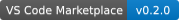

# Zellner Theme Extended for Visual Studio Code

The extended companion pack adds **8 light and dark variations** to the two core themes in [**Zellner Theme**](https://marketplace.visualstudio.com/items?itemName=YueYu.vscode-theme-zellner) ([Open VSX](https://open-vsx.org/extension/YueYu/vscode-theme-zellner)).

---

## 🎨 Included Theme Families (8 Themes)

### 1. Zellner Bright & Zellner Bright Dark
Unified pure-white (`#FFFFFF`) and pitch-black (`#000000`) editor and sidebar surfaces paired with vibrant magenta (`#FF00FF` / `#FF66FF`) active tab top borders.

| **Zellner Bright** | **Zellner Bright Dark** |
| :---: | :---: |
|  |  |

### 2. Zellner Bright Magenta & Zellner Bright Magenta Dark
High-contrast unified workbench surfaces with bold magenta (`#FF00FF` / `#FF66FF`) interactive buttons, focus rings, and active tab indicators.

| **Zellner Bright Magenta** | **Zellner Bright Magenta Dark** |
| :---: | :---: |
|  |  |

### 3. Zellner Soft & Zellner Soft Dark
Warm, eye-comfort paper (`#FAF9F6`) and charcoal slate (`#181A1F`) backgrounds with softened contrast and gently desaturated Zellner syntax tokens.

| **Zellner Soft** | **Zellner Soft Dark** |
| :---: | :---: |
|  |  |

### 4. Zellner Pastel & Zellner Pastel Dark
Delicate, low-saturation pastel syntax palettes on soothing cream (`#F6F4F0`) and deep twilight (`#1E2028`) surfaces designed for extended coding sessions.

| **Zellner Pastel** | **Zellner Pastel Dark** |
| :---: | :---: |
|  |  |

---

## 🚀 Activation

1. Open **Command Palette**: `Ctrl+Shift+P` (Windows/Linux) or `Cmd+Shift+P` (macOS).
2. Type **Preferences: Color Theme** (`Ctrl+K Ctrl+T` or `Cmd+K Cmd+T`).
3. Choose any of the 8 extended Zellner variants.

---

## 🛠️ Building

From the [`yuyuqp/zellner`](https://github.com/yuyuqp/zellner) monorepo root, run `pnpm build` to generate both packs, or `pnpm run build` here to generate these eight themes only.

---

## 📄 Credits & License

* Authored and maintained by **Yue Yu** under the [MIT License](https://github.com/yuyuqp/zellner/blob/main/LICENSE).
* Original Vim colorscheme designed and authored by **Ron Aaron** (`ron@ronware.org`), maintained in the [Vim colorschemes repository](https://github.com/vim/colorschemes) under the [Vim License](https://vimhelp.org/uganda.txt.html#license).
* Workbench and syntax theme templates adapted from Visual Studio Code default themes ([`microsoft/vscode`](https://github.com/microsoft/vscode)), Copyright (c) Microsoft Corporation (MIT License).